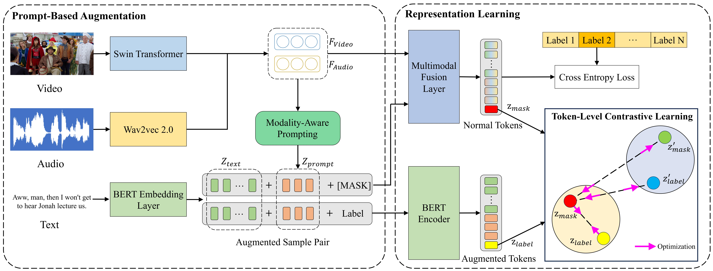
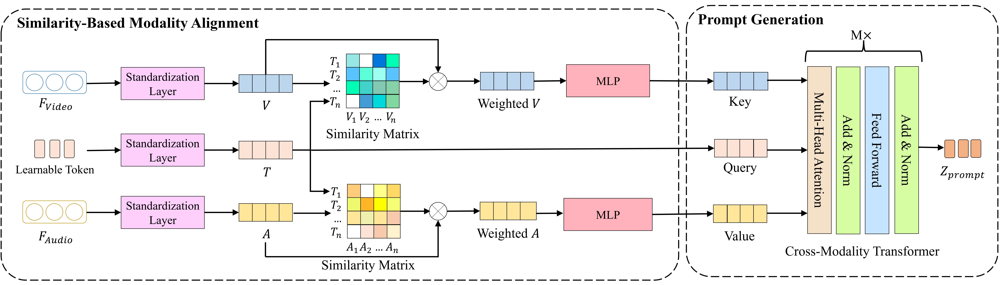
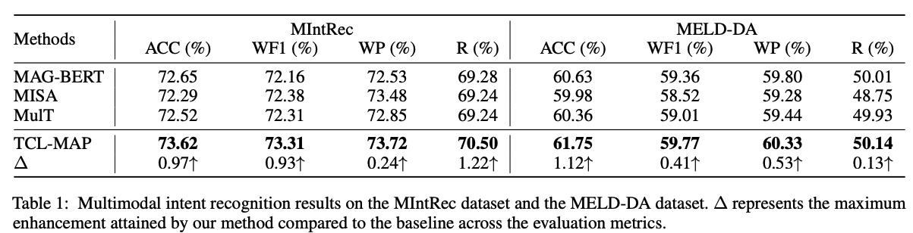

# Token-Level-Contrastive-Learning-with-Modality-Aware-Prompting-for-Multimodal-Intent-Recognition

This repository provides the official PyTorch implementation of the research paper:

 [Token Level Contrastive Learning with Modality Aware Prompting for Multimodal Intent Recognition](https://arxiv.org/abs/2312.14667) (**Accepted by [AAAI2024](https://aaai.org/Conferences/AAAI-24/)**). 

## 1. Introduction

In multimodal real-world scenarios, humans interpret intents using modalities like expressions, body movements, and speech tone. Yet, most methods neglect the links between modalities and fail in learning nonverbal semantic features. Our paper presents the TCL-MAP approach, leveraging video and audio-based prompts to enhance text representation, thereby guiding the learning of semantic features across modalities.

## 2. Dependencies 

We use anaconda to create python environment:

```
conda create --name python=3.6
```

Install all required libraries:

```
pip install -r requirements.txt
```

## 3. Usage

You can evaluate the performance of our proposed TCL-MAP on [MIntRec](https://dl.acm.org/doi/pdf/10.1145/3503161.3547906) and [MELD-DA](https://aclanthology.org/2020.acl-main.402.pdf) by using the following commands:

- MIntRec

```
sh examples/run_TCL_MAP_MIntRec.sh
```

- MELD-DA

```
sh examples/run_TCL_MAP_MELD.sh
```

You can change the parameters in the **configs** folder. The default parameter is the best parameter on two datasets

## 4. Model

The overview model architecture:



The details of MAP module:



## 5. Experimental Results



## 6. Citation

If you are insterested in this work, and want to use the codes or results in this repository, please **star** this repository and **cite** by:

```
@misc{zhou2023tokenlevel,
      title={Token-Level Contrastive Learning with Modality-Aware Prompting for Multimodal Intent Recognition}, 
      author={Qianrui Zhou and Hua Xu and Hao Li and Hanlei Zhang and Xiaohan Zhang and Yifan Wang and Kai Gao},
      year={2023},
      eprint={2312.14667},
      archivePrefix={arXiv},
      primaryClass={cs.MM}
}
```

## 7. Acknowledgments

Some of the codes in this repo are adapted from [MIntRec](https://github.com/thuiar/MIntRec/tree/main), and we are greatly thankful.

If you have any questions, please open issues and illustrate your problems as detailed as possible.


